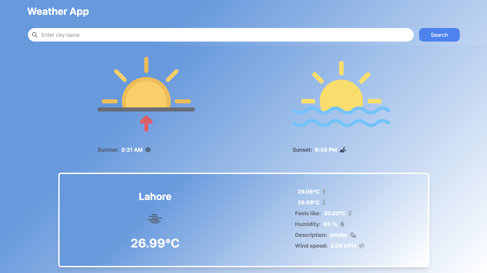

## React Weather

## Tech Stack

React, JavaScript, Tailwind CSS

### Feature

Search weather forecast for any city or place.
Responsive for all screen sizes.

### Getting Started

First you need an API key from OpenWeatherMap, you can get one by creating an account on their website. After you get your API key, create a .env file at root directory of project, copy the line below to the file and replace YOUR_KEY with your OpenWeatherMap API Key.

REACT_APP_API_KEY=YOUR_KEY

Finally clone this repository, install dependencies and run the local server

https://github.com/mashalmaqsood/Weather-App.git

cd weather-app
npm install
npm start
